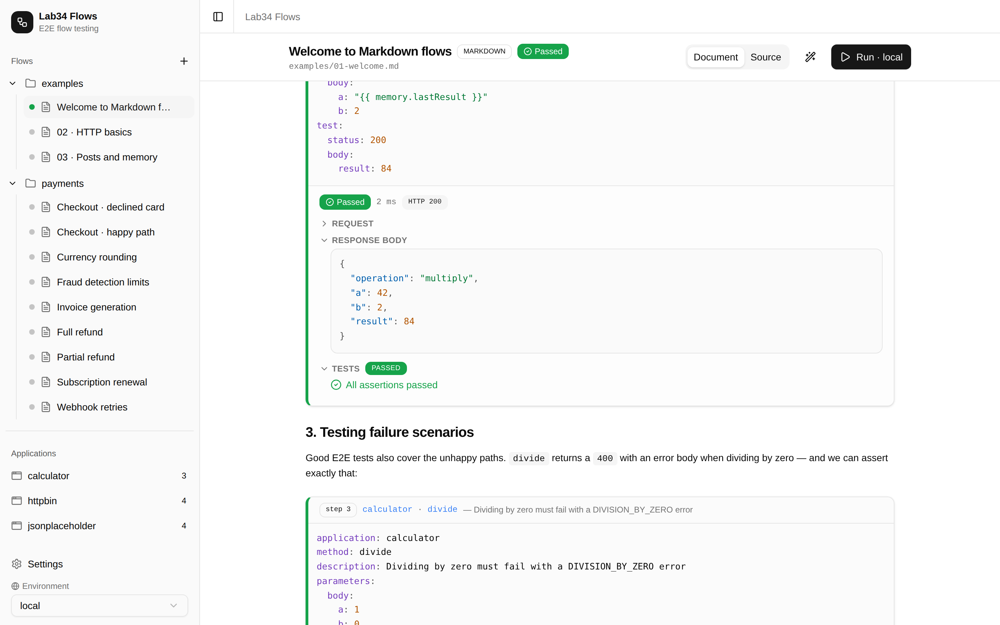
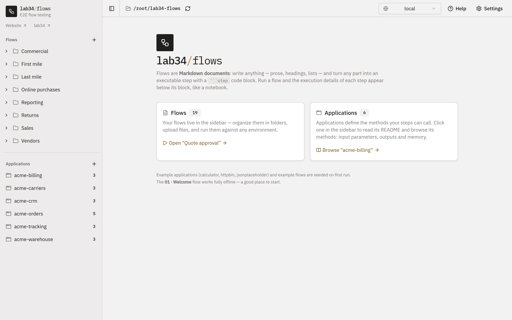
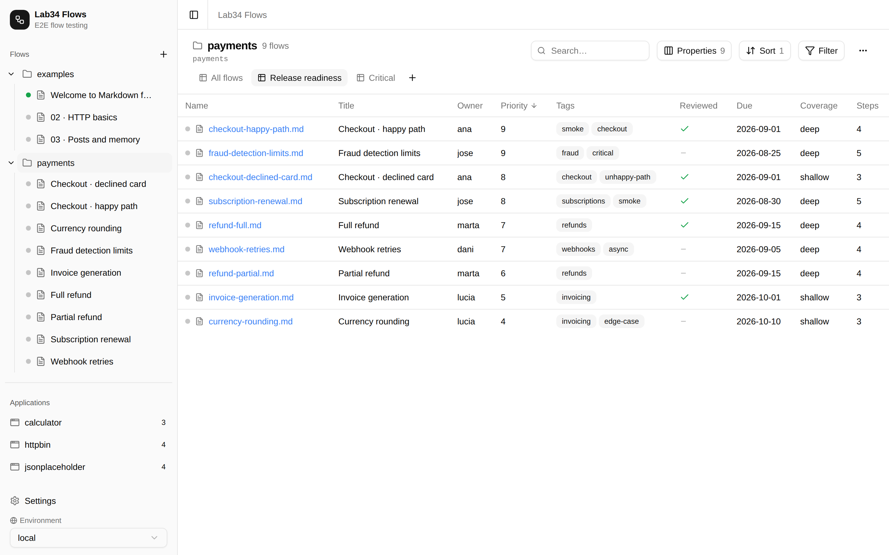
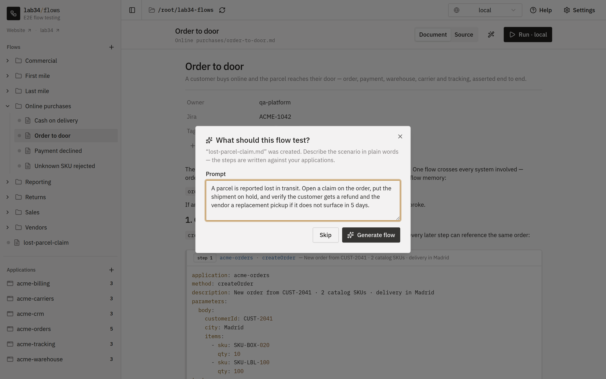
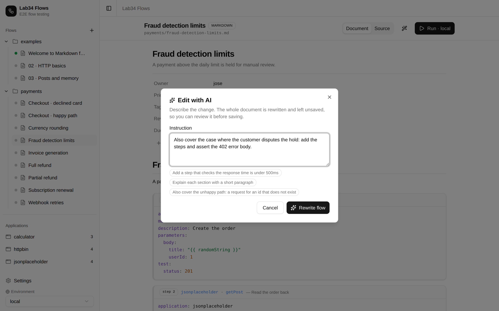
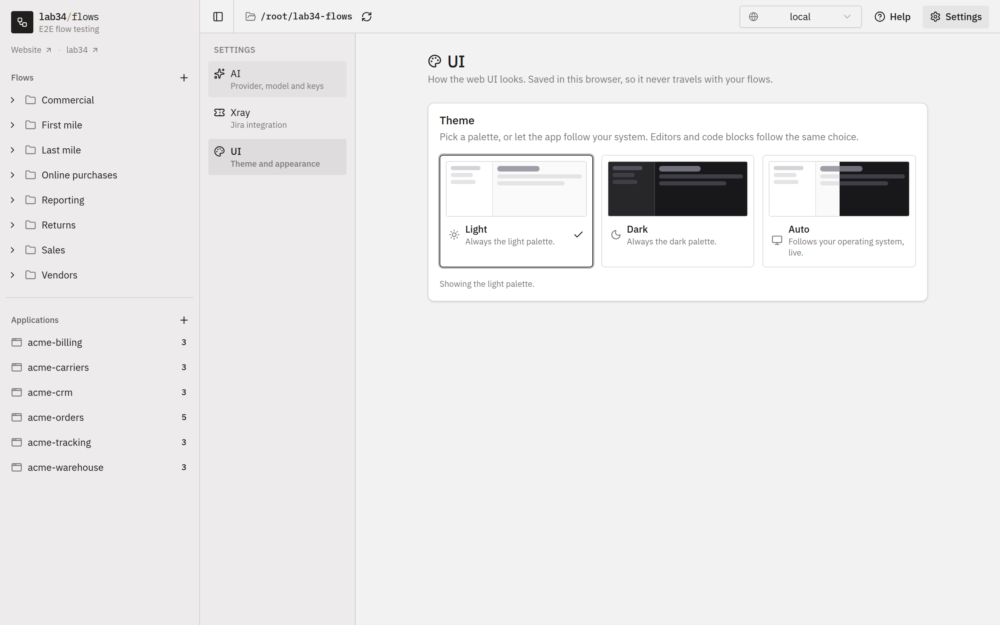

<div align="center">

# lab34/flows

**Trigger, understand and test E2E flows and behaviours.**

[](https://github.com/lab34-es/flows/actions/workflows/ci.yml)
[](https://github.com/lab34-es/flows/actions/workflows/ci.yml)
[](https://www.npmjs.com/package/@lab34/flows)
[](https://www.npmjs.com/package/@lab34/flows)

<p align="center">
  <a href="https://flows.lab34.es/docs/">Documentation</a> ·
  <a href="https://flows.lab34.es/docs/quick-start/">Quick start</a> ·
  <a href="https://flows.lab34.es/">Website</a> ·
  <a href="https://github.com/lab34-es/flows/issues">Issues</a>
</p>

<a href="website/src/assets/screenshots/flow-light.png">
  
</a>

</div>

---

Flows is a tool for testing end-to-end flows and behaviours across the systems
you actually run: HTTP APIs, MQTT topics, PostgreSQL databases and web
applications. The same flow runs from the web UI while you are writing it, from
the CLI on your machine, and unattended in your CI/CD pipelines.

A flow is a **Markdown document**. You write whatever you want — headings,
prose, notes — and mark the executable parts as ` ```step ` code blocks. Run
it, and the request, response, assertions and timings of each step appear right
below the block that produced them, notebook style.

````markdown
---
title: Fraud detection
description: Fraud must be detected when the customer is flagged
---

# Fraud detection

The invoice endpoint must refuse to answer for a flagged customer.

```step
application: "accounting"
method: "getInvoice"
parameters:
  params:
    customerId: "{{ randomInt0_100 }}"
mimic:
  - application: "fraud"
    url: "/fraud-detection"
test:
  status: 404
  body:
    error:
      code: "ACCOUNTING_FRAUD_DETECTED"
```
````

## Screenshots

| Home | Folder | AI create | AI edit | Settings |
| --- | --- | --- | --- | --- |
| [](website/src/assets/screenshots/home-light.png) | [](website/src/assets/screenshots/folder-light.png) | [](website/src/assets/screenshots/ai-create-light.png) | [](website/src/assets/screenshots/ai-edit-light.png) | [](website/src/assets/screenshots/settings-light.png) |

## Features

- **Flows as Markdown.** Documentation and executable steps in the same file,
  versioned in your own git repository.
- **Notebook-style web UI.** Live status per flow, folder views you can sort and
  filter, and per-step execution details.
- **Write flows with AI.** Describe a scenario and get a flow built from your own
  applications — with local Ollama, Google Gemini or Anthropic.
- **Assertions built in.** Assert status and body, including JavaScript
  expressions, and reuse the same flows in CI/CD through the CLI.
- **Mimic dependencies.** Fake what a dependency answers so failure scenarios
  can be reproduced locally.
- **Multi-protocol.** HTTP APIs, MQTT (including asynchronous, out-of-band
  assertions), PostgreSQL and browser automation via Playwright.
- **Random data on every run.** A large set of replacers for ids, dates and
  fake data.
- **Secrets stay out of the repo.** One env file per application per
  environment, kept in your context folder.
- **Batteries included.** Example applications and flows are seeded on first run.

## Install

Requires Node.js `>= 20.19.0`.

```bash
npm install -g @lab34/flows
```

See [Quick start](https://flows.lab34.es/docs/quick-start/) for the first-run
walkthrough.

## Usage

```bash
lab34-flows --server                                  # web UI on http://localhost:3001
lab34-flows --file flows/my-flow.md --env production  # run a flow headlessly
lab34-flows --capabilities                            # list available applications and methods
lab34-flows --help
```

Full reference: [Running flows](https://flows.lab34.es/docs/running/) and
[Command line](https://flows.lab34.es/docs/cli/).

## Documentation

Everything — step blocks, replacers, properties, integrations, troubleshooting —
lives at **[flows.lab34.es/docs](https://flows.lab34.es/docs/)**. The same
articles ship inside the app's Help section, so the website and the tool never
disagree.

The docs source lives in [`website/`](website/).

## Development

The package is written in TypeScript and published as CommonJS: `src/` compiles
into `dist/`, which is what `npm publish` ships, together with the type
declarations. The web UI (`frontend/`) is TypeScript too.

```bash
npm install              # CLI, API and helpers
npm run install:frontend # web UI

npm run dev              # API on :3001, restarted on change (tsx, no build step)
npm run frontend         # web UI on :3000
npm run dev:full         # both at once

npm run build            # compile src/ -> dist/ and copy the bundled examples
npm run typecheck        # tsc over src/ and tests/, no emit
npm run lint             # eslint + typescript-eslint
npm test                 # jest
npm run test:coverage    # jest with the coverage gate
npm run coverage:badge   # refresh .github/badges/coverage.svg
npm run audit:ci         # fail if any critical advisory is present
```

The frontend has its own config: `npm run lint|typecheck|build --prefix frontend`.

### Quality gates

Every pull request, and every push to `master`, runs
[`.github/workflows/ci.yml`](.github/workflows/ci.yml). A change cannot land
unless all of it passes:

| Gate | What it checks |
| --- | --- |
| Lint | `eslint` over `src/`, `tests/` and `frontend/src/`, clean |
| Types | `tsc --noEmit` for the package and for the frontend, clean |
| Coverage | statements, branches, functions and lines of `src/` all **above 80%** |
| Audit | `npm audit` finds **no critical** advisory in the root, frontend or website tree |
| Build | `dist/` compiles and `node dist/cli.js --help` runs; the frontend builds |

The threshold lives in [`jest.config.js`](jest.config.js) (`coverageThreshold`),
so the number is defined once and CI simply runs `npm run test:coverage`.
Coverage is collected from *all* of `src/`, not only the files a test happens to
import. The same gates run again against the exact commit being released, in
[`.github/workflows/npm-publish.yml`](.github/workflows/npm-publish.yml).

### Dependency pinning

Every dependency is recorded as an exact version, with no `^` or `~` range, in
all three package trees. `.npmrc` sets `save-exact=true` so `npm install <pkg>`
keeps it that way. Upgrades are deliberate, reviewable commits rather than
something that drifts in on a fresh install.

## License

[MIT](LICENSE.md) © [Lab34](https://lab34.es)
