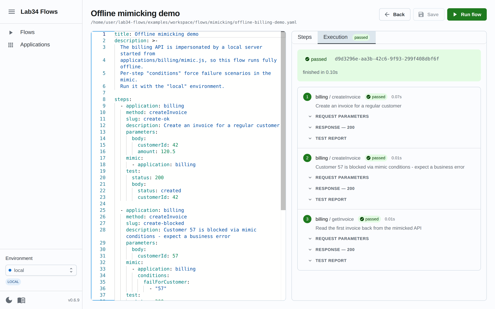

# Lab34 Flows

**Define, run and test end-to-end flows across your systems — from a GUI, the CLI, or CI.**

Flows are YAML files your whole team can read, review and share. Steps call
*applications* (small Node.js adapters for your APIs, databases, brokers and
websites), assertions live next to each step, and dependencies can be mimicked
locally so failure scenarios are one line of YAML away.

```yaml
title: Order lifecycle
steps:
  - application: shop-api
    method: createOrder
    slug: create
    parameters:
      body:
        customerId: "{{ randomInt0_100 }}"    # fresh random data on every run
    test:
      status: 201
      body:
        status: created

  - application: shop-api
    method: getOrder
    parameters:
      params:
        id: "{{ steps.create.response.body.orderId }}"   # chain step data
    test:
      status: 200
```



## Why

- **Shareable test scenarios** — a failing case is a YAML file, not a verbal
  explanation. Version it, review it, re-run it.
- **One tool from laptop to CI** — the same flow runs in the GUI with live
  progress, in the terminal with rich output, and in CI with exit codes.
- **Test the awkward parts** — async side effects over MQTT, PostgreSQL state,
  browser journeys (Playwright), and dependencies you'd rather fake than call.

## Features

- 🖥️ **Web GUI** — browse and edit flows (Monaco editor with live step preview),
  run them and watch every request/response/test verdict stream in live,
  manage per-environment variables. `lab34-flows --server`
- 🧪 **Tests per step** — status and body assertions, deep subset matching,
  `$expr:` JavaScript expressions, retries for eventually-consistent systems.
- 🎲 **Random data on every run** — `{{ randomEmail }}`, `{{ uuid }}`,
  `{{ timeAgo 5 'days' }}` and friends, plus cross-step references and flow memory.
- 🪞 **Mimic dependencies** — impersonate downstream services locally and force
  failure scenarios through per-step conditions. Works fully offline.
- 📡 **Protocol reach** — HTTP APIs, PostgreSQL, MQTT (latent assertions),
  and web apps via Playwright.
- 🤖 **AI flow generation** — describe the scenario in plain language; the AI
  drafts the YAML grounded on *your* applications and methods (Gemini).
- 🔐 **Environments done right** — credentials live in per-application `.env`
  files, never in flows; secret-looking values are masked in output and UI.

## Quickstart

```bash
npm install -g @lab34/flows

# try the bundled examples
git clone https://github.com/lab34-es/lab34-flows.git
cd lab34-flows

# fully offline demo (the "billing" API is mimicked locally)
lab34-flows --context examples/workspace --file flows/mimicking/offline-billing-demo.yaml --env local

# or explore everything from the GUI
lab34-flows --server --context examples/workspace
# → http://localhost:3001
```

Then create your own workspace: [Getting started](docs/getting-started.md).

## Documentation

| | |
|---|---|
| [Getting started](docs/getting-started.md) | Install → workspace → first flow in 5 steps |
| [The GUI](docs/gui.md) | Editing, running with live progress, environments |
| [CLI reference](docs/cli.md) | Flags, exit codes, CI usage |
| [Flow files](docs/flows.md) | The YAML format, chaining steps, memory |
| [Testing](docs/testing.md) | Assertions, `$expr:`, retries, MQTT latent tests |
| [Replacers](docs/replacers.md) | All `{{ ... }}` generators |
| [Applications](docs/applications.md) | Teach the tool your systems |
| [Mimicking](docs/mimicking.md) | Fake dependencies, force failures |
| [Environments](docs/environments.md) | `.env` files, secrets, PostgreSQL |
| [Playwright](docs/playwright.md) | Browser automation |
| [AI generation](docs/ai-flow-generation.md) | Flows from natural language |
| [Architecture](docs/architecture.md) | For contributors |

## Examples

[`examples/workspace`](examples) is a complete workspace: two applications
(a public HTTP API and a mimicked one) and four flows covering requests,
random data, chained steps, error assertions and offline mimicking — each one
annotated. [Start there.](examples/README.md)

## Development

```bash
npm install && npm run install:frontend
npm run dev:full     # API on :3001 + frontend (Vite) on :3000
npm test             # jest
npm run lint         # backend + frontend
```

See [Architecture](docs/architecture.md) for the lay of the land.

## License

MIT © [Jose Constela](mailto:jose@lab34.es)
