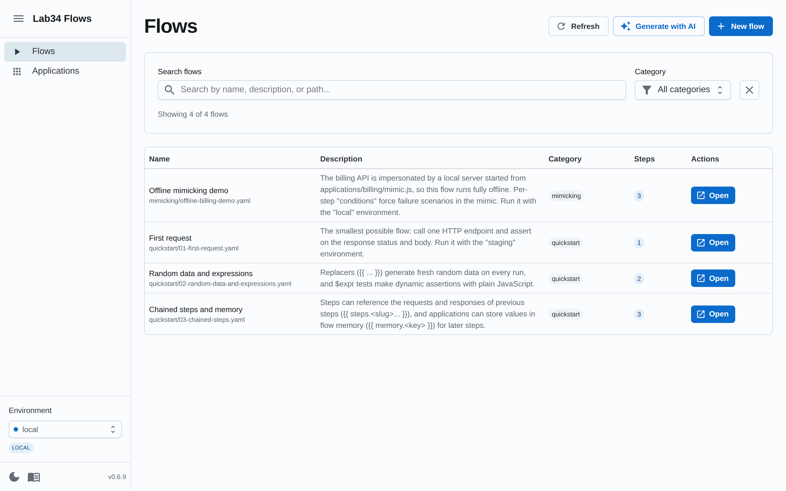
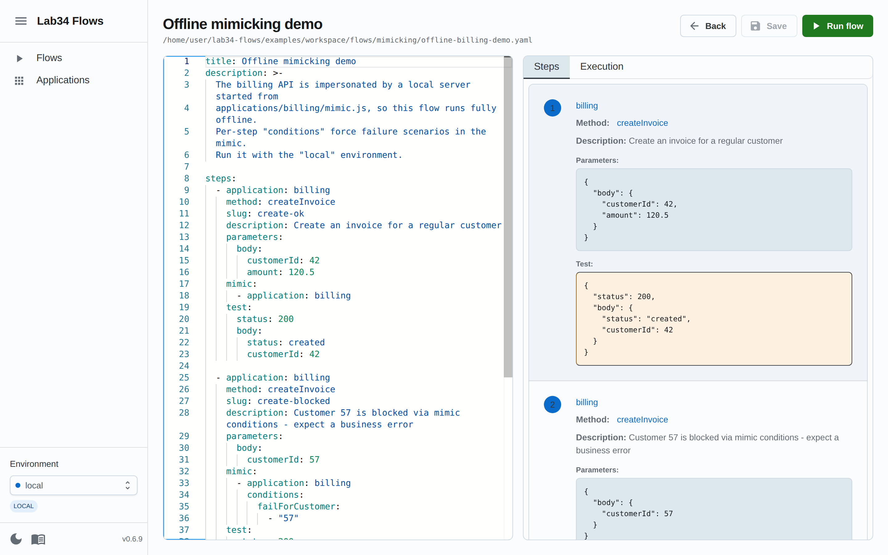
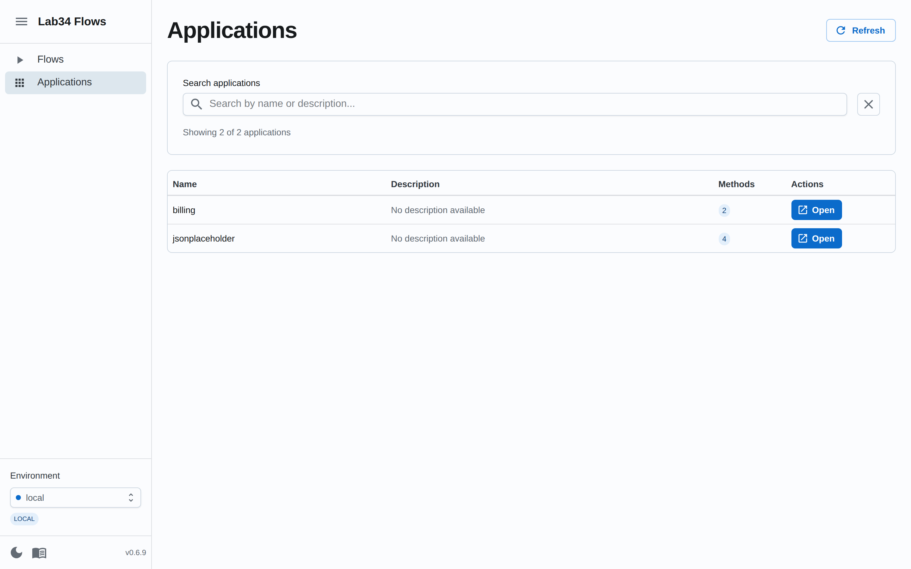

# The GUI

The web GUI lets you browse, edit, create and **run flows with live progress**,
and manage application environments — all against your local workspace.

## Starting it

```bash
lab34-flows --server                    # default workspace (~/lab34-flows)
lab34-flows --server --context <dir>    # a specific workspace
```

Then open <http://localhost:3001>.

For development of the tool itself, run the API and the Vite dev server
separately — see [Architecture](architecture.md#development-setup).

## Flows page



- Lists every YAML flow found in `<workspace>/flows` (recursively; sub-folders
  become categories).
- Search by name, description or path, and filter by category.
- **New flow** creates a file from a starter template in the folder you choose.
- **Generate with AI** turns a natural-language prompt into a flow you can
  review, tweak and save. Requires [AI configuration](ai-flow-generation.md).

## Flow editor



Opening a flow shows a split view:

- **Left — YAML editor** (Monaco). Changes are parsed as you type; the Steps
  panel updates live and YAML errors are surfaced immediately.
- **Right — Steps**: a readable preview of each step (application, method,
  parameters, tests) with links to the application definitions.
- **Save** writes the file back to disk (the button lights up when there are
  unsaved changes).
- **Run flow** executes the current editor content — you can try changes
  without saving first.

## Running flows


Pressing **Run flow** asks for the environment (defaulting to the one selected
in the sidebar) and switches to the **Execution** tab, where every step reports
live over a socket connection:

- per-step status: pending → running → passed / failed / error
- request parameters after replacement (the actual random values used)
- response status, headers and body
- test report with expected vs actual for every failed assertion
- retry attempts, durations, and the overall execution result

One execution runs at a time; starting a second one while a flow is running
returns a clear error.

## Applications page



- Lists every application in the workspace with its methods, descriptions and
  parameter schemas (as reported by each method).
- Shows the environment files of each application. Values whose keys look
  secret (`password`, `token`, `secret`, ...) are masked in the table view.
- Environment files can be edited per-variable or as raw text with syntax
  highlighting.

## Sidebar

- **Environment selector** — the globally selected environment, color-coded by
  type (local / development / staging / uat / production). It is remembered
  across sessions and used as the default when running flows.
- **Dark / light mode** toggle.
- **Version** of the tool and a link to the documentation. Hovering the version
  shows which workspace directory the server is using.
